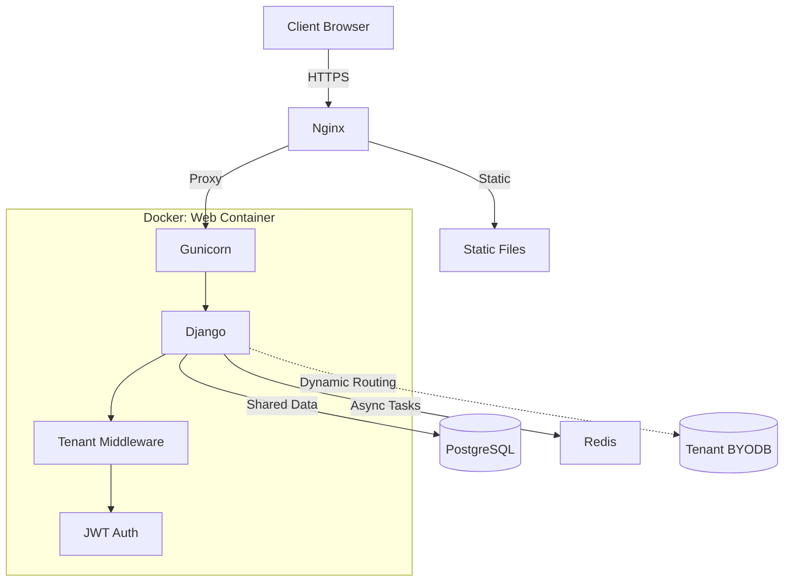

# Project Documentation: Ticket System V1

## 1. Overview
The **Multi-Tenant Ticket Management System** is a robust SaaS solution designed for organizations to manage customer support workflows. Built with Django and React-style templates, it features strict data isolation, role-based access control (RBAC), and a hybrid multi-tenancy model that supports both shared and dedicated databases (BYODB).

## 2. Technology Stack

### Backend
| Component | Technology | Description |
| :--- | :--- | :--- |
| **Framework** | **Django 5.0** | Core web framework using Python 3.12. |
| **API** | **Django REST Framework** | Powering the RESTful API endpoints. |
| **Auth** | **SimpleJWT** | Stateless JSON Web Token authentication. |
| **Task Queue** | **Celery** | Asynchronous task processing (emails, reports). |

### Database & Storage
| Component | Technology | Description |
| :--- | :--- | :--- |
| **Primary DB** | **PostgreSQL 15** | Main relational store for tenants and platform data. |
| **Cache** | **Redis 7** | Caching, Session storage, and Celery broker. |
| **BYODB** | **PyMySQL / PyMongo** | Connectors for tenants bringing their own databases. |

### Infrastructure
| Component | Technology | Description |
| :--- | :--- | :--- |
| **Server** | **Gunicorn** | WSGI application server. |
| **Proxy** | **Nginx** | Reverse proxy, SSL termination, and static file serving. |
| **Container** | **Docker** | Full containerization with Docker Compose. |

## 3. Architecture & Workflow

### A. Hybrid Multi-Tenancy
The system architecture supports two types of tenants simultaneously:
1.  **Standard Tenants (Shared)**: Data resides in the primary PostgreSQL database, isolated logically by `organization_id`.
2.  **Premium Tenants (BYODB)**: Data resides in the tenant's own external database. The system routes queries dynamically using a custom `DatabaseRouter`.

### B. Request Lifecycle
1.  **Entry**: `HTTPS` request hits **Nginx**.
2.  **Routing**: Nginx proxies traffic to **Gunicorn/Django**.
3.  **Middleware**: `TenantMiddleware` intercepts the request.
    -   Extracts `company_name` from the URL path (e.g., `/api/acme/...`).
    -   Validates the Organization exists in Redis/DB.
    -   Sets `request.organization` context.
4.  **DB Routing**:
    -   If the organization has a specific DB config, `TenantDatabaseRouter` directs queries to that connection.
    -   Otherwise, the `default` shared database is used.
5.  **View Processing**: DRF ViewSet executes business logic.
6.  **Response**: JSON data is returned.

### C. Architecture Diagram


## 4. Key Features
-   **Path-Based Routing**: Clean URLs like `trackmytickets.in/acme/dashboard` and `api/acme/tickets`.
-   **Role-Based Access**: Granular permissions (Platform Admin, Org Admin, Manager, Agent, Customer).
-   **Dynamic Settings**: Tenants can configure operational limits and feature flags.
-   **Security**:
    -   **Fernet Encryption** for stored database credentials.
    -   **Strict IDOR Protection** via organization-scoped querysets.
    -   **Secure Cookies** and **CSRF** protection.

## 5. Directory Structure
```
ticket_system_django/
├── apps/               # Modular Django Apps
│   ├── accounts/       # Auth, Users, Organizations
│   ├── tickets/        # Tickets, Projects, Comments
│   ├── core/           # Middleware, Utils, Base definitions
│   └── notifications/  # Email & In-app notifications
├── config/             # Settings (Split into base, prod, dev)
├── deploy/             # Docker & Nginx configurations
├── scripts/            # DevOps & Maintenance scripts
└── templates/          # Server-side rendered UI (Jinja2/Django)
```

## 6. Deployment
For detailed deployment instructions, including SSL setup and backup strategies, refer to **[DEPLOYMENT.md](DEPLOYMENT.md)**.

### Quick Commands
```bash
# Start Production
docker-compose up -d --build

# Run Migrations
docker-compose exec web python manage.py migrate

# Create Admin
docker-compose exec web python manage.py createsuperuser
```
