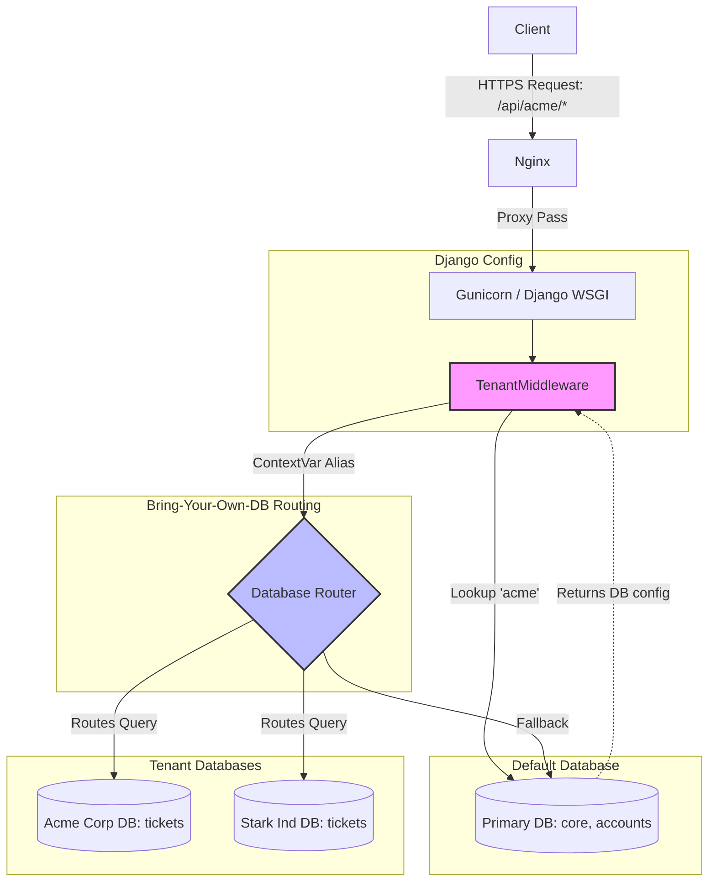
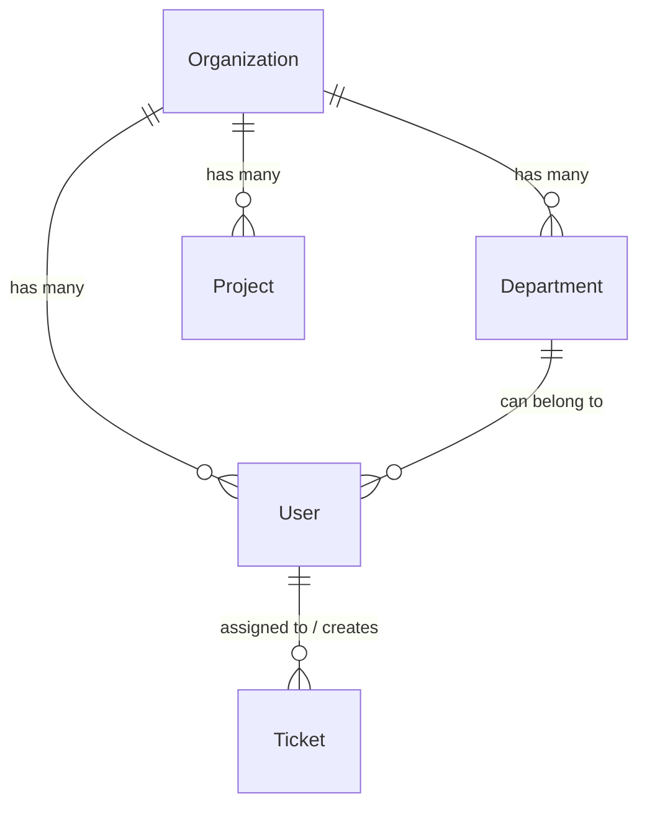
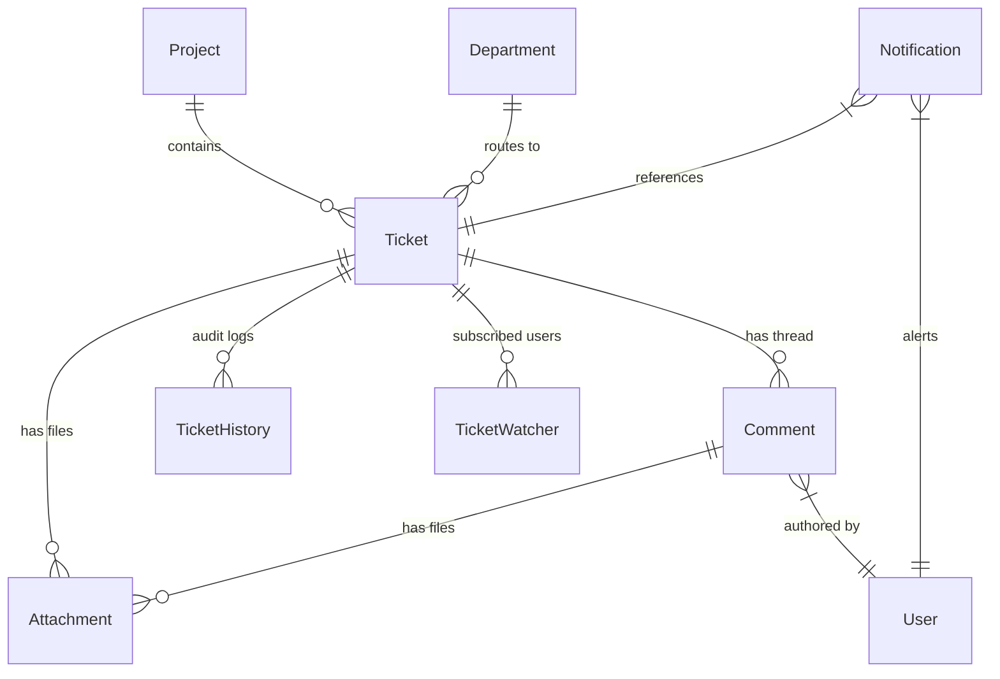
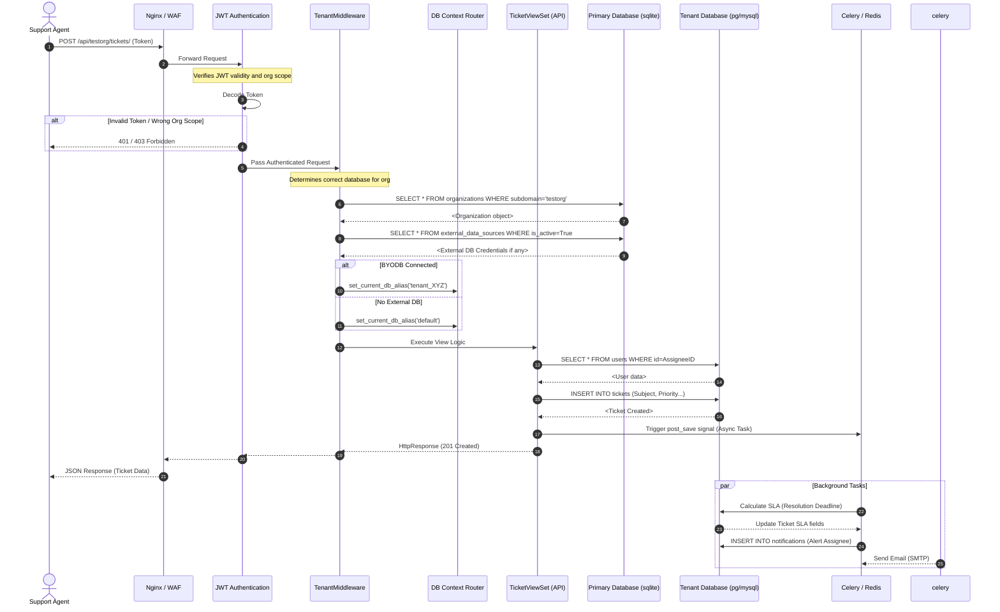

# Multi-Tenant Ticket System Architecture

This document outlines the core architecture of the Multi-Tenant Enterprise Support Desk, specifically focusing on how the Database, Organizations, Multi-tenancy, Tickets, Comments, Notifications, and Users interact.

## 1. Multi-Tenant Architecture (Bring Your Own Database)

The system is designed around a **Data Sovereignty** model. Instead of storing all tenants' data in a single massive database with Foreign Key filters (logical isolation), this system uses **Physical Isolation (BYODB)** for ticket data.

### How it works:
1. **Primary Database (`db.sqlite3` / Default DB):** 
   - Stores global configurations, super-admins (Platform Admins), and the `Organization` catalog.
   - Stores the active `ExternalDataSource` credentials for each organization.
   - For demo accounts or orgs without external databases, it serves as the fallback storage.
2. **Tenant Databases:**
   - When a request comes in (e.g., to `/api/acme/tickets/`), the system parses `acme`.
   - The `TenantMiddleware` securely looks up the `Organization` where `subdomain='acme'`.
   - It queries the `ExternalDataSource` table to see if Acme has connected an external PostgreSQL/MySQL database.
   - If connected and active, the middleware registers a dynamic DB alias (`tenant_<id>`) and uses Python `ContextVar` to securely route **all subsequent queries** in that request to Acme's private database.
   - Tenant data never shares a table with another tenant.

### Visual Architecture Flow

---

## 2. Organizations & Users Hierarchy

Organizations are the top-level entity. Every User belongs directly to one Organization.

- **Organizations:** Define the subdomain (`testorg`), branding, subscription plan, and limits.
- **Departments (Optional):** Sub-divisions within an organization (e.g., "IT Support", "HR"). Departments have `default_assignees` to auto-route incoming tickets.
- **Projects:** Logical groupings of tickets (e.g., "Website Redesign").
- **Users:**
  - `admin`: Has full control over the Organization settings, Departments, Projects, and can see all tickets.
  - `manager`: Can manage Projects and oversee all tickets.
  - `department_head`: Oversees a specific department and its statistics.
  - `agent`: Standard support agent. Can only act on assigned tickets or view tickets within their Project restrictions.

---

## 3. Tickets, Comments, and Notifications

The core workflow engine revolves around the `Ticket` model.

### Tickets
Tickets are bound to an Organization and optionally to a `Project` and/or `Department`. 
- **Fields:** Subject, Description, Status (`open`, `in_progress`, `resolved`, `closed`), Priority, and Due Date.
- **SLA Engine:** Tickets automatically track First Response Time and Resolution Time against the configured `SLAPolicy`.
- **Merging & Linking:** Tickets can be merged together to handle duplicate submissions.

### Comments
Comments represent the conversation thread of a ticket.
- **Public Comments:** Visible to the customer/creator.
- **Internal Notes:** Private remarks visible only to `agents`, `managers`, and `admins`. Used for backend coordination.
- **Attachments:** Both tickets and comments support multiple file attachments, securely stored in tenant-isolated AWS S3 prefixes or local media folders.

### Notifications
The system uses an asynchronous event-driven approach. 
When a ticket is updated or commented on, signals trigger Celery workers.
- **Models:** Records of unread/read alerts tracking State Changes (e.g., "Ticket Assigned to You", "SLA Breached").
- **Delivery:** Notifications run primarily in-app via the API (`/api/{org}/notifications/`), but the architecture supports modular Email and WebSocket delivery extensions.

### Entity Relationship Walkthrough

---

## 4. System Interactions

1. **Inbound Request:** The user hits `/api/testorg/tickets/`.
2. **Authentication:** The JWT token is validated. The token contains an `org_id` claim, ensuring tokens from `acme` cannot be used on `testorg` URLs (Cross-Tenant Replay Protection).
3. **Database Routing:** TenantMiddleware identifies `testorg`. If a custom DB is connected, it locks the query stream to that specific DB.
4. **Authorization:** Drf permissions (`IsOrgMember`) ensure the User's database record matches the URL organization context.
5. **Business Logic:** The `TicketViewSet` executes the query. Due to N+1 optimizations, it uses `select_related` and `prefetch_related` to fetch the Ticket, its Assignee (User), and Tags in just 2 queries.
6. **Outbound Notification:** If the action was creating a ticket, Django Signals fire asynchronously via Redis/Celery to insert a new `Notification` row for the assigned user, completely decoupled from the HTTP response time.

---

## 5. Detailed End-to-End Request Flow

The following sequence diagram illustrates the lifecycle of a ticket creation request traversing through Nginx, Authentication, the Tenant Data router, Business Logic, and firing asynchronous SLA/Notification background tasks.

