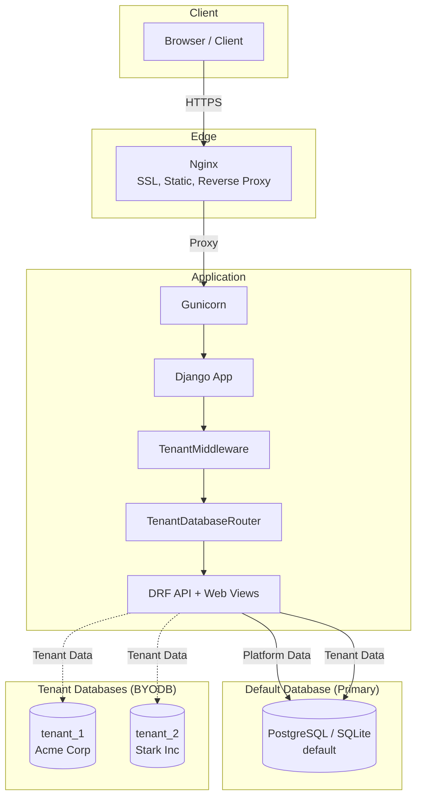
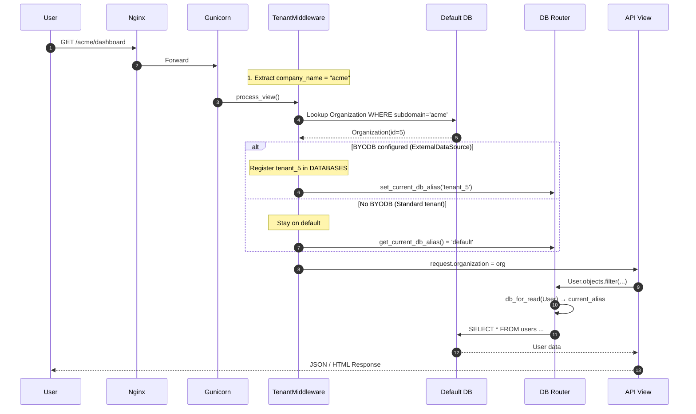
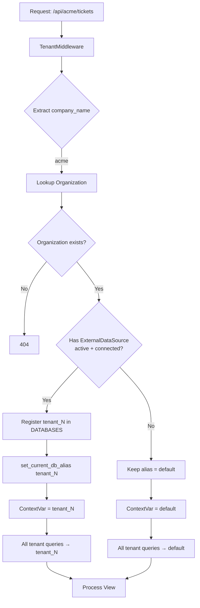
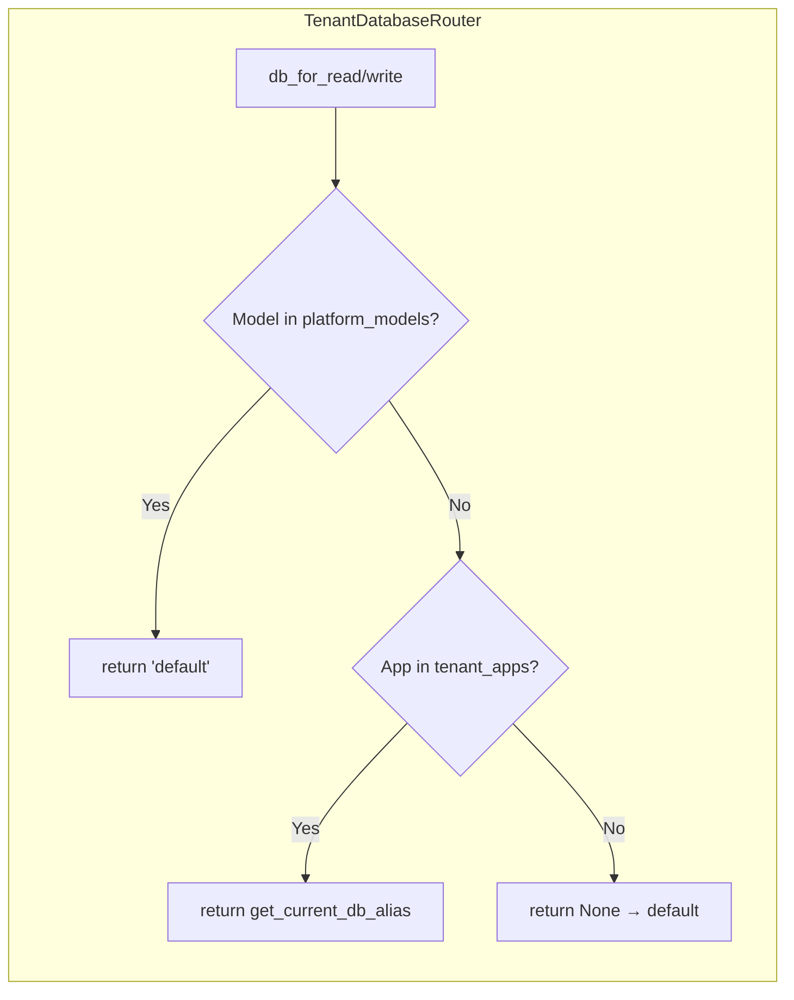

# TrackMyTickets — Full Architecture & Multi-Tenant Database Design

This document describes the complete architecture, request flow, and multi-tenant database design of the TrackMyTickets system.

---

## 1. Overview

**TrackMyTickets** is a multi-tenant SaaS ticket management system. It supports:

- **Path-based routing**: URLs like `trackmytickets.in/acme/dashboard` and `api/acme/tickets`
- **Hybrid multi-tenancy**: Shared database (default) or Bring-Your-Own-Database (BYODB) per organization
- **Role-based access**: Platform Admin, Org Admin, Manager, Agent

### Technology Stack

| Layer | Technology |
|-------|------------|
| Backend | Django 5.0, Django REST Framework |
| Auth | SimpleJWT (stateless JWT) |
| Primary DB | PostgreSQL / SQLite |
| Cache / Sessions | Redis (optional) or DB |
| Server | Gunicorn, Nginx |

---

## 2. High-Level Architecture



---

## 3. Request Flow



---

## 4. Multi-Tenant Database Design

### Two Modes of Operation

| Mode | Database | When Used |
|------|----------|-----------|
| **Standard (Shared)** | `default` | No ExternalDataSource for the organization. All tenant data in one DB, isolated by `organization_id`. |
| **BYODB (Dedicated)** | `tenant_{org_id}` | Organization has an active ExternalDataSource. Data in tenant's own DB. |

### How Routing Works

1. **TenantMiddleware** runs on every request with a `company_name` in the path.
2. It looks up `Organization` in the **default** DB.
3. If the org has an active `ExternalDataSource`:
   - Registers `tenant_{org_id}` in `settings.DATABASES` (if not already)
   - Sets `set_current_db_alias('tenant_{org_id}')`
4. If not:
   - Leaves alias as `default` (from `reset_current_db_alias()` at start).

5. **TenantDatabaseRouter** uses `get_current_db_alias()` to decide where each ORM query goes.

### Flow Diagram: Database Selection



---

## 5. Data Placement by Database

### Default Database (Primary)

**Always used for platform-level and cross-tenant data.**

| App | Model | Table | Purpose |
|-----|-------|-------|---------|
| accounts | Organization | organizations | Tenant catalog, subdomain mapping |
| accounts | PlatformAdmin | platform_admins | Platform super-admins |
| accounts | GlobalUser | global_users | Cross-tenant user directory (email → tenant mapping) |
| accounts | OrganizationSecret | organization_secrets | Encrypted secrets per org |
| core | ExternalDataSource | external_data_sources | BYODB connection configs (encrypted) |
| core | Feedback | feedback | User feedback (platform-level) |
| core | Enquiry | enquiries | Landing page contact form |
| core | SchemaMapping | schema_mappings | External table → Project mapping |
| tickets | AuditLog | audit_log | Platform audit trail |
| django | auth, sessions, contenttypes, etc. | — | Built-in Django tables |

### Tenant Database (default or tenant_N)

**Operational data — scoped by organization. Lives in `default` when no BYODB, else in `tenant_{org_id}`.**

| App | Model | Table | Purpose |
|-----|-------|-------|---------|
| accounts | User | users | Org users (admin, manager, agent) |
| accounts | Department | departments | Org departments |
| accounts | UserRole | user_roles | Scoped roles (org/dept/project) |
| tickets | Tag | tags | Ticket tags |
| tickets | SLAPolicy | sla_policies | SLA definitions |
| tickets | Project | projects | Ticket projects |
| tickets | Workflow | workflows | Status workflows |
| tickets | Ticket | tickets | Support tickets |
| tickets | TicketWatcher | ticket_watchers | Watchers |
| tickets | TicketHistory | ticket_history | Audit per ticket |
| tickets | Attachment | attachments | File attachments |
| tickets | CannedResponse | canned_responses | Quick replies |
| tickets | KBCategory | kb_categories | Knowledge base |
| tickets | KBArticle | kb_articles | KB articles |
| comments | Comment | comments | Ticket comments |
| notifications | Notification | notifications | In-app alerts |

### Summary Table

| Database | Contains |
|----------|----------|
| **default** | Organizations, PlatformAdmins, GlobalUsers, OrganizationSecrets, ExternalDataSources, Feedback, Enquiries, SchemaMapping, AuditLog, Django internals |
| **tenant_N** (or default) | Users, Departments, UserRoles, Tags, SLAPolicy, Projects, Workflows, Tickets, Comments, Notifications, Attachments, KB, CannedResponses, etc. |

---

## 6. TenantDatabaseRouter Logic



**Platform models** (always `default`):
- `accounts.organization`
- `accounts.platformadmin`
- `accounts.organizationsecret`
- `accounts.globaluser`
- `core.externaldatasource`
- `tickets.auditlog`

**Tenant apps** (use current alias): `accounts`, `tickets`, `comments`, `notifications`

---

## 7. URL Structure

```
/                           → Landing page
/health/                    → Health check
/api/platform/              → Platform API (no tenant)
/api/<company_name>/auth/   → Tenant auth (login, token)
/api/<company_name>/        → Tickets, notifications, core
/<company_name>/login       → Tenant login page
/<company_name>/dashboard  → Tenant dashboard
```

---

## 8. Hybrid User Model (GlobalUser + User)

For login and cross-tenant lookup:

1. **User** (tenant DB): Actual user record per organization.
2. **GlobalUser** (default DB): Maps `(email, organization_id)` → `tenant_user_id` for JWT validation and cross-org uniqueness.

On first login with a valid JWT, TenantMiddleware checks `GlobalUser` exists; if not, it syncs from `User` (`sync_global_user`).

---

## 9. Directory Structure

```
ticket_system_django/
├── apps/
│   ├── accounts/        # Users, Orgs, PlatformAdmin, GlobalUser
│   ├── tickets/         # Tickets, Projects, Comments, etc.
│   ├── comments/        # Comment model
│   ├── notifications/   # Notification model, email service
│   └── core/             # Middleware, routers, models (Feedback, ExternalDataSource)
├── config/               # Settings (base, dev, production)
├── templates/            # HTML templates
├── docs/                 # Documentation
└── scripts/              # DevOps scripts
```

---

## 10. Key Files Reference

| File | Role |
|------|------|
| `apps/core/routers.py` | TenantDatabaseRouter, ContextVar for DB alias |
| `apps/core/middleware/tenant.py` | TenantMiddleware (org lookup, BYODB registration) |
| `apps/accounts/models.py` | Organization, User, GlobalUser, Department |
| `config/urls.py` | URL routing with `<company_name>` |
| `config/settings/base.py` | DATABASES, DATABASE_ROUTERS |
